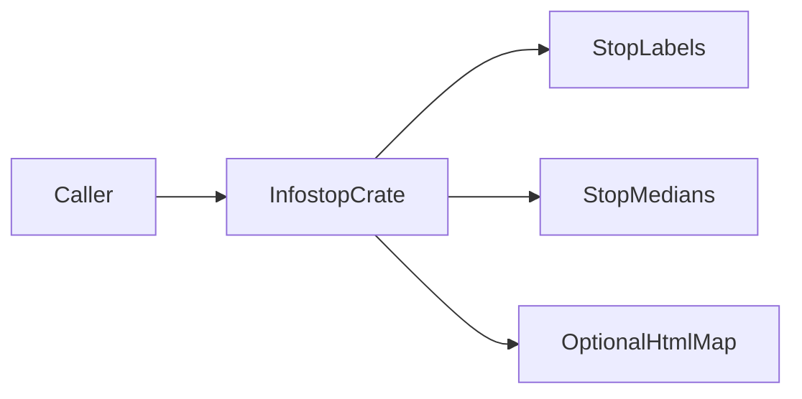
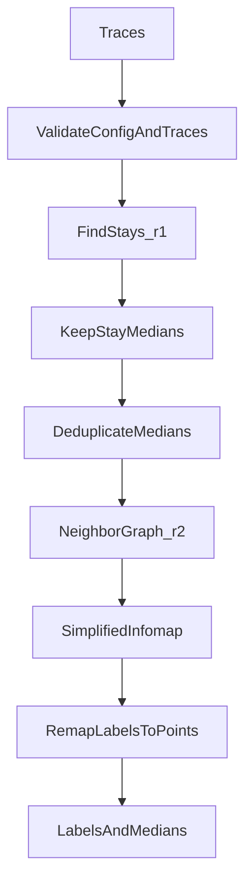
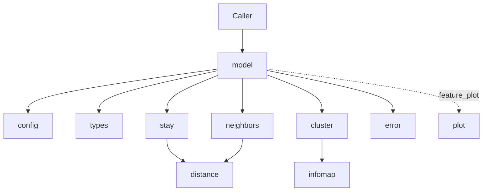
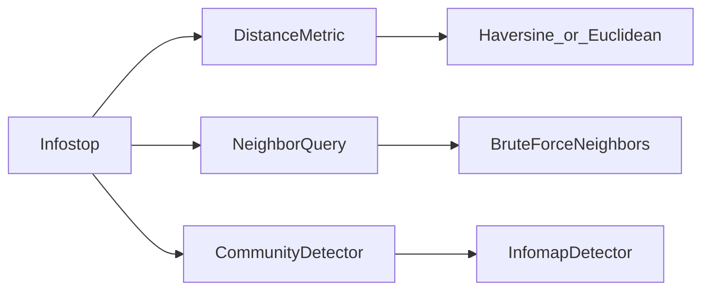

# Infostop architecture

This document gives the high-level system architecture of the Infostop crate.

## Purpose and scope

Infostop finds **stops** in location **trajectories**.
A trajectory is a sequence of location **points**.
A point can also have a time value.

This file covers:

- The crate shape and module map
- The stop-detection data flow
- Pipeline internals (fit state, stays, graph, Infomap, remapping)
- Public API and extension points
- Error contracts at a high level

This file does **not** cover:

- Full usage examples — see [README.md](../../README.md)
- Pipeline edit rules and defaults — see [infostop-pipeline](../skills/infostop-pipeline/SKILL.md) and [reference.md](../skills/infostop-pipeline/reference.md)
- Agent index — see [AGENTS.md](../../AGENTS.md)

## System context

The caller sends trajectories into the Infostop crate.
The crate returns stop **labels** and stop **medians**.
With the optional `plot` feature, the crate can write an HTML map file.

The core crate uses `std` only.
The crate has no required third-party dependencies.
The `plot` feature is empty of third-party crates.
The minimum supported Rust version (MSRV) is 1.74.



## High-level pipeline

`Infostop` in [`src/model.rs`](../../src/model.rs) runs these steps:

1. Validate the config and the traces.
2. Find **stays** in each trajectory. Use radius `r1`. Keep the **median** of each stay. See [`src/stay.rs`](../../src/stay.rs).
3. Deduplicate the medians. You can use an optional spatial grid.
4. Build a neighbor graph. Use radius `r2`. See [`src/neighbors.rs`](../../src/neighbors.rs).
5. Cluster the graph with simplified Infomap. See [`src/cluster.rs`](../../src/cluster.rs) and [`src/infomap/mod.rs`](../../src/infomap/mod.rs).
6. Remap community labels onto the input points.

Each input point gets one **label**:

- A label `>= 0` is a stop id.
- The label `-1` (`NON_STOP`) means the point is not part of a stop.

See [Infomap (in-crate)](#infomap-in-crate) for the Infomap limits versus upstream Infomap.



## Module map

| Module | Role |
| ------ | ---- |
| `model` | Orchestration and public `Infostop` API |
| `config` | Hyperparameters and validation |
| `types` | `Point`, `TimedPoint`, `StopLabel`, `NON_STOP` |
| `stay` | Sequential stay detection |
| `distance` | Haversine and Euclidean distance |
| `neighbors` | Radius neighbor query |
| `cluster` | Edge build and `CommunityDetector` |
| `infomap` | Simplified two-level Infomap |
| `error` | `Error` and `Result` |
| `plot` | Leaflet HTML map (`plot` feature) |



## Fit state and generics

`Infostop` is generic over `D: CommunityDetector` and `N: NeighborQuery`.
Default types are `InfomapDetector` and `BruteForceNeighbors`.

The struct holds:

- `config`
- `detector`
- `neighbors`
- `unique_stays` — unique stay coordinates from the last successful fit
- `unique_labels` — community labels for those unique stays
- `fitted` — `true` only after a successful fit

A successful fit caches unique stay coordinates and their labels only.
The crate returns per-point labels to the caller.
The crate does not store per-point labels on the model.

If fit returns `Error::NoStopsFound`, `fitted` stays `false`.

The default detector uses `trials: 3` and `config.seed`.
Use `Infostop::with_parts` to inject a custom detector or neighbor query in tests.

Post-fit accessors include `label_medians`, `stationary_points`, and `stationary_labels`.

## Stay detection

[`src/stay.rs`](../../src/stay.rs) returns `StayEvents`:

- `medians` — one median **point** per accepted stay
- `event_map` — per input point: stay index, or `NON_STOP`

The join test uses distance to the **running median**, not the first point.
The module keeps sorted latitude and longitude buffers for that median.

Untimed trajectory:

- Join a point if distance to the running median is `<= r1`.
- Accept a stay if the group size is `>= min_size`.

Timed trajectory (every point has a time):

- Join if distance is `<= r1` and the time gap is `<= max_time_between`.
- Accept a stay if size is enough and duration is `>= min_staying_time`.

Times are never required.
If any point in a trajectory has a time, every point in that trajectory must have a time.
Times must be non-decreasing.
A mix of timed and untimed points in one trajectory is `InvalidInput`.

## Unique medians and the neighbor graph

If `min_spatial_resolution > 0`, the model snaps each median axis with `(c / res).round() * res`.
If the resolution is `0`, the model does not snap.

Uniqueness uses exact `f64` bit keys for `(x, y)`.
The unique step returns:

- the unique coordinate list
- an inverse map from each stay median to its unique index
- visit **counts** per unique coordinate

[`BruteForceNeighbors`](../../src/neighbors.rs) is O(n²).
The graph is undirected.
Each neighbor list includes the node itself.

[`build_edges`](../../src/cluster.rs) builds the Infomap network:

- A node with only itself in its neighbor list is a **singleton** (no edges).
- Undirected edges use `neighbor > node` so each pair appears once.
- Base edge weight is `max(counts[i], counts[j])` as `f64`.
- If `weighted` is on, weight is multiplied by `d.max(1e-12).powf(-weight_exponent)`.

## Infomap (in-crate)

[`src/infomap/mod.rs`](../../src/infomap/mod.rs) implements a simplified two-level Infomap.

`Network` is undirected.
The builder rejects self-loops and non-positive weights.
Duplicate edge pairs are merged.

`run_infomap`:

- Runs `trials` independent searches from a singleton partition (`trials` is at least 1).
- Keeps the partition with the lowest map equation `L`.
- Uses greedy node moves with incremental ΔL.
- Uses an xorshift64 RNG from the configured seed.
- Caps each trial at 100 rounds.

If total edge weight is empty, each node is its own module.

This detector does **not** implement:

- Multilevel aggregation
- Teleportation

Partitions can differ from upstream Infomap.
Do not change partition semantics without a clear design change.

## Label remapping and multi-trace

[`InfomapDetector`](../../src/cluster.rs) excludes singletons from the Infomap network.
Non-singleton nodes are remapped to a dense index for Infomap, then mapped back.

If `label_singleton` is `true`, singletons get new stop ids after `max_label`.
If `label_singleton` is `false`, singletons stay `NON_STOP`.
If every unique label is `NON_STOP`, fit returns `Error::NoStopsFound`.

Remapping to input points:

1. Map unique labels onto stay events with the inverse index.
2. Map stay events onto points with `event_map`.
3. An `event_map` value of `-1` becomes `NON_STOP`.


`fit_predict_many` concatenates stay medians from all traces, then runs uniqueness once.
Stop ids are therefore **shared** across traces.

## Inputs, metrics, and plot

`fit_predict` and `fit_predict_many` accept types that convert with `Into<TimedPoint>`:

- `[f64; 2]`, `(f64, f64)`, `Point` — no time
- `[f64; 3]`, `(f64, f64, f64)` — `(x, y, time)`
- `TimedPoint`

An empty list of traces is `InvalidInput`.

Distance metrics:

| Metric | Units | Notes |
| ------ | ----- | ----- |
| `Haversine` (default) | metres | `Point` is **(lat, lon)** as `(x, y)`; lat/lon bounds are checked |
| `Euclidean` | same units as `r1` / `r2` | Planar |

`EARTH_RADIUS_M` is `6_371_000`.

`plot_map` (feature `plot`) needs a fitted Haversine model.
It writes Leaflet HTML and loads map assets from a CDN.

For default hyperparameters, see [reference.md](../skills/infostop-pipeline/reference.md).

## Public surface and extension points

Stable public surface:

- `Infostop::builder`
- `fit_predict`
- `fit_predict_many`
- `label_medians`
- Optional `plot_map` behind `--features plot`

Extension traits:

| Trait | Default | Role |
| ----- | ------- | ---- |
| `DistanceMetric` | `Haversine` or `Euclidean` via `MetricKind` | Spatial distance |
| `NeighborQuery` | `BruteForceNeighbors` | Radius search over medians |
| `CommunityDetector` | `InfomapDetector` | Graph to community labels |

Use `Infostop::with_parts` to inject a detector or neighbor query in tests.



## Errors and contracts

| Variant | When it occurs |
| ------- | -------------- |
| `InvalidInput` | Bad config or bad traces |
| `NoStopsFound` | Fit finds no labeled stops |
| `NotFitted` | A post-fit method runs before a successful fit |
| `Io` | File write failure, for example map output |

Validate config and traces before fit.
Return `Error::InvalidInput` on bad input.
`plot_map` needs a fitted Haversine model and geographic coordinates.

## Verification and agent layout

Local verify commands (CI parity):

```bash
cargo fmt --all -- --check
cargo clippy --all-targets --all-features -- -D warnings
cargo test --all-features
cargo build --examples --all-features
```

Unit tests live next to modules under `src/`.
Integration and golden tests live in `tests/golden.rs`.
`tests/perf_smoke.rs` is `#[ignore]` by default.

Agent support lives under `.agents/`:

- `rules/` — crate policy
- `skills/` — pipeline and Rust design skills
- `commands/` — local verify command
- `hooks/` — rustfmt after file edit
- `docs/` — this architecture file

See [AGENTS.md](../../AGENTS.md) for the full index.
